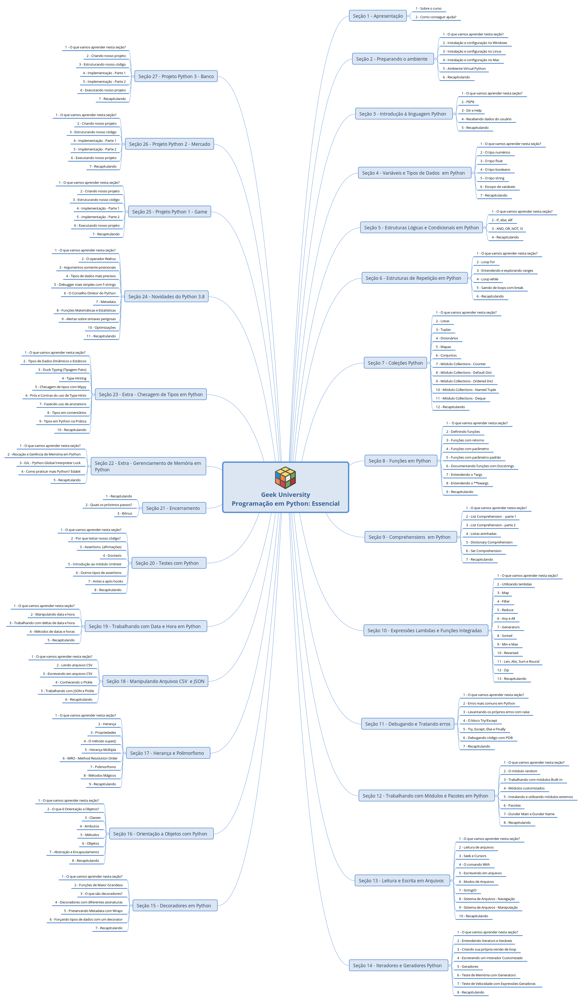
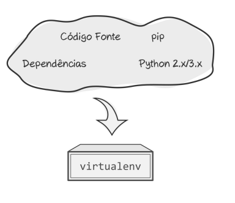
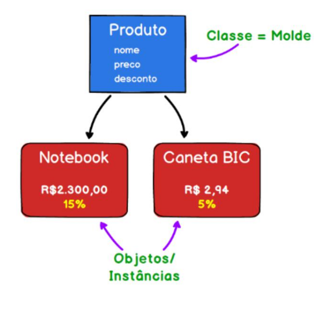

# Python Avançado - [Geek University](hpttps://www.geekuniversity.com.br)

**Aprenda sobre:**

- [Variáveis e Tipos de Dados](#variable)
- [Estruturas Lógicas e Condicionais](#conditional)
- [Estruturas de Decisão e Repetição](#repetition)
- [Coleções (Listas, Tuplas, Sets, etc)](#collections)
- [Funções](#functions)
- [Expressões Lambdas](#lambda)
- [Debugar seu código e tratar erros](#debug)
- [Módulos](#modules)
- [Leitura e Escrita em arquivos](#read)
- [Iteradores e Geradores](#iterators)
- [Decorators](#decorators)
- [Orientação a Objetos](#oop)
- [Herança e Polimorfismo](#inheritance)
- [Manipulação de Arquivos CSV e JSON](#csv_json)
- [Data e Horas](#datetime)
- [Testes](#tests)
- [Alocação e Gerenciamento de Memória](#memory)
- [Dicas e checagem de tipos](#checking_types)
- [Novidades do Python 3.8](#python38_news)
- Projeto 1: Game
- Projeto 2: Mercado
- Projeto 3: Banco

## Sobre o curso


# Preparando o ambiente

## Instalação Python no Linux

Instale os pacotes para linux: `sudo apt install build-essential zlib1g-dev libjpeg-dev libncurses5-dev libgdbm-dev libnss3-dev libssl-dev libreadline-dev libffi-dev libsqlite3-dev sqlite3 liblzma-dev curl libbz2-dev`

Baixe a versão [Python](https://www.python.org/downloads/) que quiser, extraia o diretório e execute dentro dele:

```bash
./configure --enable-optimizations --with-ensurepip=install
make -j 8
sudo make altinstall
```

Instale ambientes virtuais: `sudo pip install virtualenvs virtualenvwrapper`

## Ambiente Virtuai Python

Na aula de preparação do ambiente fizemos a instalação de duas bibliotecas interessantes:

- virtualenv
- virtualenvwrapper

Estas ferramentas são muito poderosas e nos permite criar ambientes isolados de desenvolvimento Python que tornam possível a utilização de diversas bibliotecas em um mesmo computador sem que haja conflitos entre elas.

Quando desenvolvemos com Python “globalmente”, ou seja, diretamente com o Python instalado no sistema operacional, ao invés de isolarmos os ambientes de cada projeto em desenvolvimento, podemos ter conflitos entre versões de bibliotecas.

Podemos por exemplo desenvolver um projeto onde determinada biblioteca, por exemplo ‘colorama’ só seja possível usar com Python 3.4 e em outro projeto fazermos uso de uma biblioteca, por exemplo ‘numpy’ na qual queremos usar os últimos recursos do Python 3.8.5.

Se não tivermos ambientes virtuais com o isolamento não seria possível fazer isso.

O funcionamento do virtualenv é bastante simples. Ele cria uma cópia de todos os diretórios necessários para que um programa Python seja executado. Desta forma, ao instalar uma nova biblioteca dentro do ambiente virtual criado, esta biblioteca será colocada no diretório do virtualenv e não mais de forma global no sistema operacional.



Desta forma, um programador profissional Python irá criar para cada projeto um ambiente virtual, de preferência com o mesmo nome do projeto para que seja fácil encontrar e fazer uso.

Por exemplo, imaginando que temos um projeto de um e-commerce, podemos criar um ambiente virtual conforme: `mkvirtualenv ecommerce`

Ao usar o PyCharm ou outra IDE, devemos criar um projeto com este mesmo nome.

**OBS:** No PyCharm ao criar um novo projeto Python será
criado um ambiente virtual automaticamente com o mesmo
nome do projeto criado.

# Introdução à linguagem Python

## PEP8 - Python enhancement proposal

Há um padrão de escrita adotado mundialmente para desenvolvimento em python chamado [PEP8](https://www.python.org/dev/peps/pep-0008/).

1. Use camel-case for class names, examples: Computer, ScientificComputing, IDoNotKnowWhatNameToChooseForThisClass
```python
   class ScientificComputing():
       pass
```


2. Use lowercase names for functions and variables. For longer names, split words with underscore _
```python
   def soma_2(x,y):
       return x+y
```


3. Use 4 spaces for indentation! (Don't use tab)
```python
   if 'a' in 'banana':
       print('tem')
```


4. Blanklines: learn from PyCharm because it incorporates PEP8
  - Split functions and class definitions with two blank lines
  - Methods inside classes are split by only one blank line


5. Don't import several packages on the same line. Use one line for each.
  - No problems in importing multiple classes from a single package using:
    ```python
       from types import StringType, ListType
    ```
  - In case of several classes, it is better to use:
    ```python
       from types import {
           StringType,
           ListType,
           SetType,
           AnotherType
       }
    ```
   Place imports after commentaries and docstrings, before global variables


6. Spaces in expressions and instructions:

  - Don't do:
    ```python
       function_with_long_name ( algo[ 1 ], { outro : 2 } ):
           return      None
        
       my_dict ['key'] =   my_list [index]
       variable      = 1
       long_variable = 2
    ```

  - Do:
    ```python
       function_with_long_name(algo[1], {outro: 2}):
           return None
    ```
    <br><br>
    ```python
       my_dict['key'] = my_list[index]
       variable = 1
       long_variable = 2
    ```


7. Always finish an instruction with another line.

**[Look at the file for examples](sec03_PEP8_input/pep8.py)**

## Dir e Help

São utilitários Python para auxioniar na programação.

**Dir: Apresenta todos os atributos/propriedades e funções/métodos disponíveis**

- Uso: `dir("Geek")`; `dir(type)`
  Uma lista de métodos deste tipo irá abrir.
  
- Vamos usar um método. Exemplo: `"Geek".upper()`

**Help: Apresenta a documentação/como utilizar os atributos/propriedades de funções/métodos disponíveis para determinado tipo de dado ou variável**

- Uso: `help("Geek".upper)`; `help(<type>.<property>)`


## [Input: recebendo dados do usuário](sec03_PEP8_input/user_input_data.py)

---
<a id='variable'></a>

# Variable types


[Look at the files](sec04_types) for usage examples:

- **Numeric:**
  - **[Integer](sec04_types/integer_type.py)**
  - **[Float](sec04_types/float_type.py)**
- **[Bool](sec04_types/boolean_type.py)**
- **[String](sec04_types/string_type.py)**
- **[Variable scopes](sec04_types/variable_scope.py)**
  - Global variables: this variables flow in the entire application
  - Local variables: this variables are recognized only in the block they were declared.
  - Non-local variables: declare inside sub-functions if you want to modify parameters from the main function. 
- **[None](sec04_types/none_type.py)**

---
<a id='conditional'></a>

# Conditional structures

[Look at the files](sec05_logical) for usage examples:

- **[and, or, not, is](sec05_logical/and-or-not-is.py)**
- **[if, else, elif](sec05_logical/if_else_elif.py)**

---
<a id='repetition'></a>

# Repetition structures

[Look at the files](sec06_loop) for usage examples:

- **[for](sec06_loop/loop_for.py)**
- **[range](sec06_loop/iterator_range.py)**
- **[while](sec06_loop/loop_while.py)**
- **[break](sec06_loop/breaks.py)**

---
<a id='collections'></a>

# Collections

Deep copy and shallow copy:

This is a deep copy:
```python
   list2 = list1
````

This is a shallow copy:
```python
   list2 = list1.copy()
```

[Look at the files](sec07_collections) for more usage examples:

- **[lists](sec07_collections/lists.py)**
- **[tuples](sec07_collections/tuples.py)**
- **[dictionaries](sec07_collections/dictionaries.py)**
- **[maps](sec07_collections/maps.py)**
- **[sets](sec07_collections/sets.py)**
- **[collections.Counter](sec07_collections/collections.Counter.py)**
- **[collections.defaultdict](sec07_collections/collections.defaultdict.py)**
- **[collections.OrderedDict](sec07_collections/collections.OrderedDict.py)**
- **[collections.NamedTuple](sec07_collections/collections.NamedTuple.py)**
- **[collections.deque](sec07_collections/collections.deque.py)**

---
<a id='functions'></a>

# Functions

**OBS:** if you are writing very complex and lengthy functions, your code is ugly, unreadable and perhaps unmaintainable. Try to reformulate your code looking for simpler and smaller functions.

Why creating functions? DRY - Don't repeat yourself

[Look at the files](sec08_functions) for usage examples:

- **[Define functions](sec08_functions/define_functions.py)**
- **[Docstrings](sec08_functions/docstrings.py)**
- **[*args](sec08_functions/*args.py)**
- **[**kwargs](sec08_functions/*kwargs.py)**

---
<a id='comprehensions'></a>

# Comprehensions

[Look at the files](sec09_comprehension) for usage examples:

- **[List Comprehension](sec09_functions/list_comprehension.py)**
- **[Nested Lists](sec09_functions/nested_lists.py)**
- **[Dictionary Comprehension](sec09_functions/dictionary_comprehension.py)**
- **[Set Comprehension](sec09_functions/set_comprehension.py)**

---
<a id='lambda'></a>

# Lambda expressions and built-in functions

[Look at the files](sec10_lambda_and_builtins) for usage examples:

- **[Using lambdas](sec10_lambda_and_builtins/lambda.py)**

- **Built-ins:**
  - **[map](sec10_lambda_and_builtins/maps.py)**
  - **[filter](sec10_lambda_and_builtins/filter.py)**
  - **[reduce](sec10_lambda_and_builtins/reduce.py)**
  - **[any, all](sec10_lambda_and_builtins/any_all.py)**
  - **[Generators](sec10_lambda_and_builtins/generators.py)**
  - **[sorted](sec10_lambda_and_builtins/sorted.py)**
  - **[min, max](sec10_lambda_and_builtins/min_max.py)**
  - **[reversed](sec10_lambda_and_builtins/reversed.py)**
  - **[len, abs, sum and round](sec10_lambda_and_builtins/abs_round_len_sum.py)**
  - **[zip](sec10_lambda_and_builtins/zip.py)**

---
<a id='debug'></a>

# Debug and treating errors

## Most common errors

TraceBack = error output

- SyntaxError: Occurs when python finds a syntax error. You wrote something python don't recognize as part of the language.

- NameError: Occurs when you use a variable/function/class name that was not defined.

- TypeError: Occurs when you pass one type to a function that don't accept it.

- IndexError: Occurs when we try to access an element from a container using an invalid index. One example is trying to access an element greater than an tuple size.

- ValueError: Occurs when a function/operator receives an argument with the correct type but inappropriate value. Example: 
    ```python
    int('some text')
    ```
    
- KeyError: Occurs when we try to access a dictionary key that don't exist. The method {}.get('key') solves this problem by doing nothing in case the 'key' don't exist.

- AttributeError: Occurs when using a attribute or function on a variable that doesn't have it.

- IndentationError: Occurs when we don't respect python identation standard, which is 4 spaces for new blocks.

See more errors [here](https://docs.python.org/3.8/library/exceptions.html).

**Exceptions and Errors are synouns in programming**

[Look at the files](sec11_debug_errors) for usage examples:

- **[raise](sec11_debug_errors/raise.py)**
- **[try, except](sec11_debug_errors/try_except.py)**
- **[try, except, else and finally](sec11_debug_errors/else_finally_try_except.py)**
- **[pdb; Python Debugger](sec11_debug_errors/PDB.py)**

---
<a id='modules'></a>

# Working with modules

[Look at the files](sec12_modules_and_packages) for usage examples:

- **[random](sec12_modules_and_packages/random_module.py)**
- **[builtins](sec12_modules_and_packages/builtin_modules.py)**
- **[Customized modules](sec12_modules_and_packages/customized_modules.py)**
- **[External modules](sec12_modules_and_packages/external_modules.py)**
- **[Packages](sec12_modules_and_packages/packages.py)**
- **[Dunder main and Dunder name](sec12_modules_and_packages/dunders.py)**

---
<a id='read'></a>

# Read and write files

[Look at the files](sec13_read_write_files) for usage examples:

- **[reading, seek and cursors](sec13_read_write_files/read_seek_cursors.py)**
- **[with](sec13_read_write_files/with_block.py)**
- **[writing](sec13_read_write_files/writing.py)**
- **[StringIO](sec13_read_write_files/stringIO.py)**
- **[Browsing files](sec13_read_write_files/browsing_files.py)**
- **[Manipulating files](sec13_read_write_files/manipulating_files.py)**

---
<a id='iterators'></a>

# Iterators and Generators

[Look at the files](sec14_iterators_and_generators) for usage examples:

- **[Iterators and Iterables](sec14_iterators_and_generators/iterators_vs_iterables.py)**
- **[Making our own loop version](sec14_iterators_and_generators/making_own_loop.py)**
- **[Customized iterator](sec14_iterators_and_generators/customized_iterator.py)**
- **[Generators](sec14_iterators_and_generators/generators.py)**

---
<a id='decorators'></a>

# Decorators

[Look at the files](sec15_decorators) for usage examples:

- **[Higher order functions](sec15_decorators/higher_order_functions.py)**
- **[Decorators](sec15_decorators/decorators.py)**
- **[Multiple signatures](sec15_decorators/multiple_signatures.py)**
- **[wraps](sec15_decorators/preserving_metadata_wraps.py)**
- **[Forcing types to functions](sec15_decorators/checking_types.py)**

---
<a id='oop'></a>

# Object Oriented Programming (OOP)



## Paradigmas de programação

O Python é uma linguagem multi-paradigma

- **Estruturada**
- **Funcional**
- **Orientada a objetos**: tem como objetivo mapear objetos do mundo real em modelos computacionais
  - Classe: Produto
  - Atributos: são características da classe. Por exemplo: nome, preço e desconto
  - Métodos: funções dentro da classe. Os métodos vão especificar como o objeto se comporta.
  - Construtor: este é um método especial, usado para criar os objetos usando a classe como modelo.
  - Objetos: são os elementos que criamos usando a classe como modelo, chamados também de instâncias. Exemplos são: Notebook e Caneta Bic

[Look at the files](sec16_object_oriented_programming) for usage examples:

- **[What is OOP?](sec16_object_oriented_programming/poo.py)**
- **[Classes](sec16_object_oriented_programming/classes.py)**
- **[Attributes](sec16_object_oriented_programming/attributes.py)**
- **[Methods](sec16_object_oriented_programming/methods.py)**
- **[Objects](sec16_object_oriented_programming/objects.py)**
- **[Abstraction and encapsulation](sec16_object_oriented_programming/abstraction_encapsulation.py)**

---
<a id='inheritance'></a>

# Inheritance and Polymorphism

Inheritance is one in which a new class is created (derived class) that inherits the features from the already existing class(Base class). Whereas polymorphism is that which can be defined in multiple forms. Inheritance supports the concept of reusability and reduces code length in object-oriented programming.

[Look at the files](sec17_inheritance_polymorphism) for usage examples:

- **[Inheritance](sec17_inheritance_polymorphism/inheritance.py)**
- **[Properties](sec17_inheritance_polymorphism/properties.py)**
- **[super() method](sec17_inheritance_polymorphism/super.py)**
- **[Multiple Inheritance](sec17_inheritance_polymorphism/multiple_inheritance.py)**
- **[Method Resolution Order (MRO)](sec17_inheritance_polymorphism/MRO_method_resotulion_order.py)**
- **[Polymorphism](sec17_inheritance_polymorphism/polymorphism.py)**
- **[Magic methods](sec17_inheritance_polymorphism/magic_methods.py)**

---
<a id='csv_json'></a>

# Manipulating CSV and JSON

[Look at the files](sec18_csv_json) for usage examples:

- **[Reading CSV](sec18_csv_json/csv_reading.py)**
- **[Writing CSV](sec18_csv_json/csv_writting.py)**
- **[Pickle](sec18_csv_json/picke_learn.py)**
- **[JSON and Pickle](sec18_csv_json/json_pickle.py)**

---
<a id='datetime'></a>

# Date and Time

[Look at the files](sec19_time_date) for usage examples:

- **[datetime](sec19_time_date/date_time.py)**
  - **[methods](sec19_time_date/methods.py)**

---
<a id='tests'></a>

# Tests

[Look at the files](sec20_testing) for usage examples:

- **[Why testing?](sec20_testing/why_testing.py)**
- **[Assert (built-in)](sec20_testing/assert.py)**
- **[Doctests](sec20_testing/doctests.py)**
- **Unittest module**
  - **[Introduction](sec20_testing/intro_unittest.py)**
  - **Practice 1 (activities):**
    - **[Classes and methods](sec20_testing/activities.py)**
    - **[Tests](sec20_testing/tests.py)**
  - **Practice 2 (Robot):**
    - **[Classes and methods](sec20_testing/robot.py)**
    - **[Tests](sec20_testing/robot_tests.py)**
  - **[Before and After Hooks](sec20_testing/before_after_hooks.py)**
  - **[Other Assertions](https://docs.python.org/3/library/unittest.html#assert-methods)**

---
<a id='closing'></a>
 
# Closing

The course ends here. The following are additionals.
 
 
---
<a id='memory'></a>
 
# Memory manager
 
 
 - **Global interpreter lock (GIL)**
 - **[Single thread](sec22_memory_manager/single_thread.py)**
 - **[Multi thread](sec22_memory_manager/multi_thread.py)**
 - **[Multi processes](sec22_memory_manager/multi_processing.py)** 

---
<a id='checking_types'></a>
 
# Checking Types (type hinting)
 
Python is a dynamically typed language and this will never change. Therefore variables have no predefined type. However, we can make our life as developers easier by fixing type hints to variables, preventing some bugs that may occur when non-wanted types are assigned.
 
 - **[Dynamic vs static typed](sec23_checking_types/02_dynamic_vs_static.py)**
 - **[Duck type concept](sec23_checking_types/03_duck_typing.py)**
 - **[Type hinting](sec23_checking_types/04_type_hinting.py)**
 - **[Type checking with MyPy](sec23_checking_types/05_type_checking_MyPy.py)** (the more usual way)
 - **[Annotations](sec23_checking_types/07_annotations.py)**
 - **[Types in comments](sec23_checking_types/08_types_in_comments.py)** (very weird)
 - **Example: card game**
   - **[Without type hinting](sec23_checking_types/jogo_cartas_v1.py)**
   - **[With type hinting](sec23_checking_types/jogo_cartas_v2.py)**
 
---
<a id='python38_news'></a>
 
# Python 3.8: New Functionalities
 
 - **[Walrus operator](sec24_python38_news/walrus_operator.py)**
 - **[Positional-only and positional-forbidden arguments](sec24_python38_news/positional_only_arguments.py)**
 - **[More precise Types](sec24_python38_news/more_precise_types.py)**
 - **[Simpler debugging with f-strings](sec24_python38_news/simpler_debugger.py)**
 - **[Metadata managing](sec24_python38_news/metadata.py)**
 - **[Math and Statistics functions](sec24_python38_news/math_statistics.py)**
 - **[SyntaxWarning](sec24_python38_news/dangerous_syntaxes.py)**
